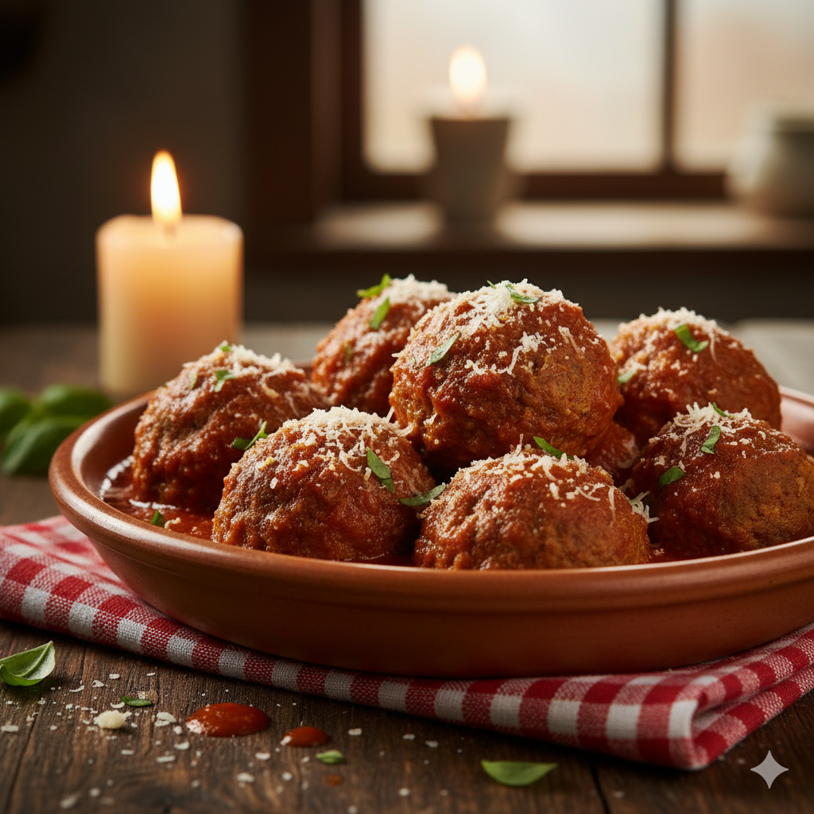
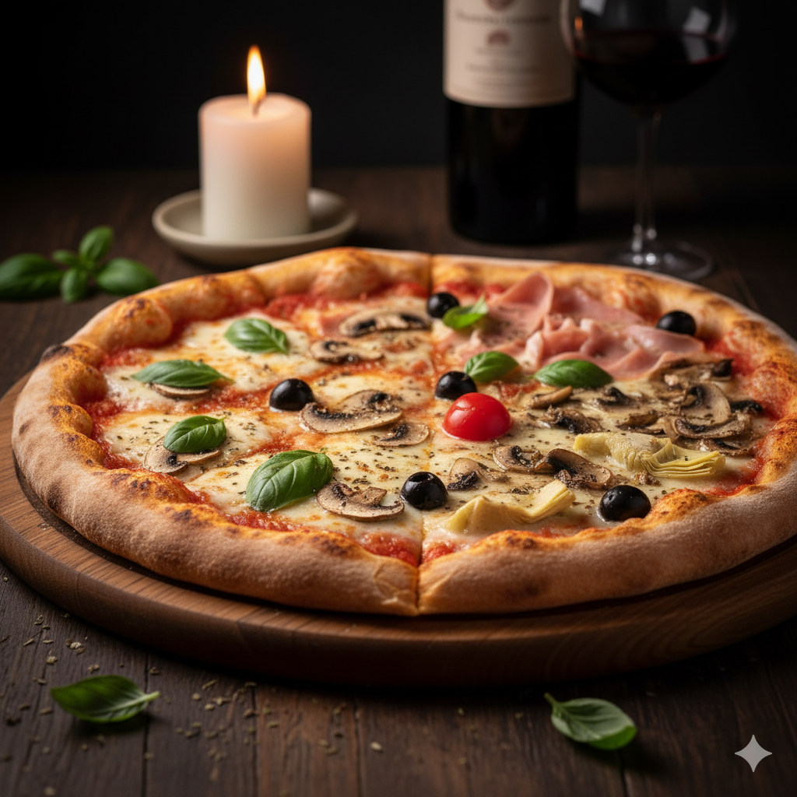

Questo menu' e' stato progettato da 4 sviluppatori ed ognuno aveva un compito:
il primo sviluppatore e' stato assegnato al menu' pizza
il secondo sviluppaore e' stato assegnato al menu' dolci 
il terzo sviluppatore e' stato assegnato al menu bevande
il quarto sviluppatore e' stato assegnato al menu' vini e liquori
Questo menu' della pizzeria "Palato Partenopeo" e' stato progettato da:
Mattia Orecchio(project manager), 
Michele Delos(collaboratore),
Giuseppe Altamore(collaboratore),
Manuel di Bonito(collaboratore, 
Francesco Mallardo finito in ospedale dopo aver assaggiato la pizza,
Alessia D'isanto giorno di festa per viaggio a "PARIGI".

<!DOCTYPE html>
<html lang="it">
<head>
  <meta charset="UTF-8" />
  <title>Pizzeria Palato Partenopeo</title>
  
</head>
<body>
  <header>
    
  </header>
  

  <!-- resto della pagina invariato... -->

  <!-- ANTIPASTI -->
  <section class="menu-section">
    <h2>Antipasti</h2>
    

      
      

        Bruschette miste
        €6.00
      

      
Pane tostato con pomodoro, aglio, basilico e olio EVO

    

    

      
      

        Tagliere di salumi e formaggi
        €12.00
      

      
Salame, prosciutto crudo, coppa, formaggi misti, miele e marmellata

    

    

      
      

        Frittura di calamari e gamberi
        €10.00
      

      
Calamari e gamberi fritti croccanti, limone

    

    

      
      

        Mozzarella in carrozza
        €7.00
      

      
Mozzarella impanata e fritta, salsa al pomodoro

    

    

      
      

        Polpette della nonna
        €6.50
      

      
Polpette di carne con salsa al pomodoro

    

    

      
      

        Caprese
        €8.00
      

      
Mozzarella di bufala, pomodoro, basilico, olio EVO

    

    

      
      

        Crostini ai funghi
        €6.50
      

      
Pane tostato con crema di funghi porcini

    

    

      
      

        Insalata di mare
        €9.00
      

      
Misto di frutti di mare, olio, limone e prezzemolo

    

    

      
      

        Olive ascolane
        €7.00
      

      
Olive verdi ripiene di carne, impanate e fritte

    

    

      
      

        Carpaccio di bresaola
        €8.50
      

      
Bresaola, rucola, scaglie di parmigiano, olio EVO

    

  </section>

  <!-- PIZZE CLASSICHE -->
<section class="menu-section">
  <h2>Pizze Classiche</h2>

  

    

      
      

        Margherita
        €6.00
      

      
Pomodoro, Mozzarella, Basilico

    

    

      
      

        Diavola
        €7.00
      

      
Pomodoro, Mozzarella, Salame piccante

    

  

  

    

      
      

        Capricciosa
        €8.00
      

      
Pomodoro, Mozzarella, Prosciutto, Funghi, Carciofi

    

    

      
      

        Quattro Stagioni
        €8.50
      

      
Pomodoro, Mozzarella, Prosciutto, Funghi, Carciofi, Olive

    

  

  

    

      
      

        Funghi
        €7.00
      

      
Pomodoro, Mozzarella, Funghi

    

    

      
      

        Marinara
        €5.00
      

      
Pomodoro, Aglio, Origano

    

  

  

    

      
      

        Napoli
        €7.50
      

      
Pomodoro, Mozzarella, Acciughe, Capperi

    

    

      
      

        Prosciutto Cotto
        €7.00
      

      
Pomodoro, Mozzarella, Prosciutto cotto

    

  

  

    

      
      

        Caprese
        €8.00
      

      
Pomodoro, Mozzarella di bufala, Basilico

    

    

      
      

        Rucola
        €8.50
      

      
Pomodoro, Mozzarella, Rucola, Scaglie di parmigiano
 
    

  

    

    

      
      

        Crocchettone
        €8.00
      

      
Crocche freschi, Prosciutto cotto, Mozzarella
 
    

    

      
      

        Wurstel e Patatine
        €8.50
      

      
 Mozzarella, Wurstel, Patatine fritte
 
    

  

</section>

  <!-- DOLCI -->
  <section class="menu-section">
    <h2>Dolci</h2>
    

      
      

        Tiramisù
        €5.00
      

      
Mascarpone, caffè, savoiardi, cacao

    

    

      
      

        Panna Cotta
        €4.50
      

      
Panna, zucchero, gelatina, frutti di bosco

    

    

      
      

        Cannoli Siciliani
        €5.50
      

      
Cialda croccante, ricotta dolce, canditi

    

    

      
      

        Crostata
        €4.00
      

      
Pasta frolla, marmellata

    

    

      
      

        Gelato
        €3.50
      

      
Varie creme e gusti

    

  </section>

  <!-- BEVANDE -->
  <section class="menu-section">
    <h2>Bevande</h2>
    

      

        Acqua naturale 0.5L
        €1.00
      

    

    

      

        Acqua frizzante 0.5L
        €1.50
      

    

    

      

        Bibita (Coca Cola, Fanta, Sprite) 0.33L
        €2.00
      

    

    

      

        Birra (bottiglia 0.33L)
        €3.00
      

    

    

      

        Vino rosso / bianco (bicchiere 0.2L)
        €4.00
      

    

  </section>

  <!-- VINI -->
<section class="menu-section">
  <h2>Vini</h2>

  

    

      Vino della casa (rosso / bianco) - Bicchiere 0.2L
      €4.00
    

  

  

    

      Falanghina (bottiglia 0.75L)
      €15.00
    

  

  

    

      Greco di Tufo (bottiglia 0.75L)
      €18.00
    

  

  

    

      Fiano di Avellino (bottiglia 0.75L)
      €18.00
    

  

  

    

      Aglianico del Vulture (bottiglia 0.75L)
      €20.00
    

  

  

    

      Chianti Classico DOCG (bottiglia 0.75L)
      €22.00
    

  

</section>

<!-- LIQUORI E DIGESTIVI -->
<section class="menu-section">
  <h2>Liquori e Digestivi</h2>

  

    

      Limoncello
      €3.00
    

  

  

    

      Amaro del Capo
      €3.50
    

  

  

    

      Amaro Lucano
      €3.50
    

  

  

    

      Grappa
      €4.00
    

  

  

    

      Sambuca
      €3.50
    

  

  

    

      Mirto
      €3.50
    

  

</section>

  <footer>
    © 2025 Pizzeria Palato Partenopeo - Tutti i diritti riservati
  </footer>

  
</body>
</html>
